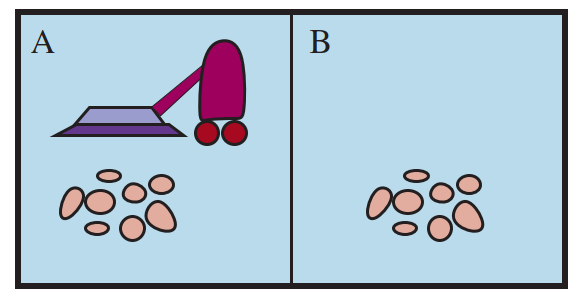

# Vacuum Cleaner Agent

[](https://github.com/SajjadAemmi/Vacuum-Cleaner-Agent/actions/workflows/python-app.yml)
[](https://github.com/SajjadAemmi/Vacuum-Cleaner-Agent/actions/workflows/python-package.yml)

Vacuum Cleaner Agent with Python. A smart agent that cleans rooms. Size of the rooms is `10x10`. Agent can move Up, Down, Left, Right and suction dust.



## Install
```
pip3 install -r requirements.txt
```

## Run
```
python3 main.py --mode one --method GBFS --input maps/map1.txt --show
```
3 modes:
- `one`: The agent can sense Clean or dirty of his room
- `nine`: The agent can sense Clean or dirty of his room and neighbor rooms
- `all`: The agent can sense Clean or dirty of all rooms

2 methods:
- `GBFS`: Greedy Best First Search search. It always prioritizes the node with the lowest heuristic value without any consideration of the cost to get to that node.
- `A*`: A* search. It always prioritizes the node with the lowest sum of heuristic value and cost to get to that node.

## ToDo
- [x] GBFS
- [ ] A*
